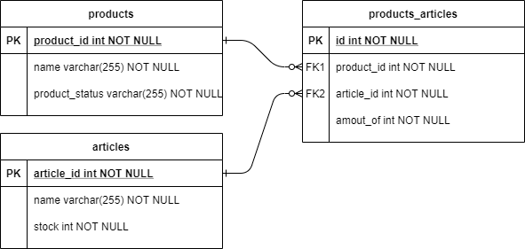

# IKEA Warehousing System Design

## Project Vision
```
Implementing a simple warehouse system to manage the products and articles.
```
### Requirements and Goals System

### Functional Requirements
```
1. Our system should load products and articles data from from a given file. 
2. User should be able to list all products and quantity of each that is an available with the current inventory.  
3. User should be able to sell a product and update the inventory accordingly.
```
### Some Design Considerations
```
1. For simplicity, let’s assume our warehousing system does not require any user authenticationm.
```
### Capacity Estimation
```
As we currently we develop a MVP system, so we don't assume that we have a large traffic on the system. 
```
### System APIs
```
We can have REST APIs to expose the functionality of warehousing service. 
```
### GET /api/v1/products/
```
APIs to select game by id to get game info {id, pits, status, winner}.
```
##### Returns: (JSON) 
Here is a sample of list products and quantity of each that is an available with the current inventory
```
[
  {
    "id": 1,
    "name": "Dining Chair",
    "availableQuantity": 2
  },
  {
    "id": 5,
    "name": "Dinning Table",
    "availableQuantity": 1
  }
]
```
### PUT /api/v1/products/{id}/sell
```
APIs to sell a product that has the gaven {id}.
```
##### return 
```
Successful (HTTP status code 204) or failed (HTTP status code 400).
```
##### Main Data Model:
```
Product: product_id, name, product_status.
Article: article_id, name, stock.
ProductArticle: product_id, article_id, amount_of.  
```
##### ERD


What kind of database should we use? 
- Currently we will use H2 - ib memory database for simplicity and easy setup (you can use any database you need by a small editing in the properties file).
- Based on the scale of the future data, we can switch to MySQL or NoSQL (A NoSQL choice would also be easier to scale.)  
